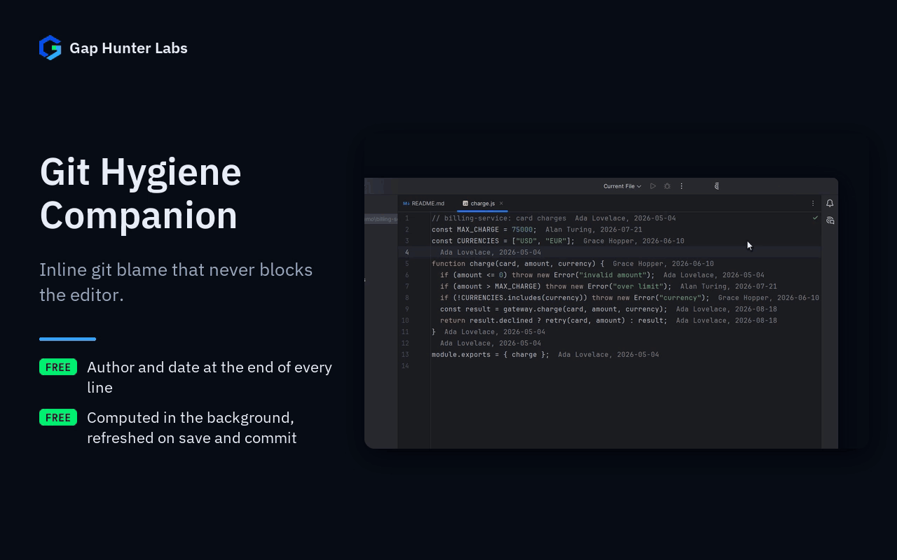

# Git Hygiene Companion

IntelliJ-family plugin. Lightweight inline git blame — author and date
at the end of each line — designed from the ground up to never
block the editor.



Each feature on its own:
[Inline blame](docs/media/01-inline-blame.gif) ·
[Unsaved edits](docs/media/02-unsaved-edits.gif) ·
[After a commit](docs/media/03-commit.gif)

## Why it exists

Born from real evidence in GitToolBox's own public issue tracker
(~10.2M downloads, 4.7★ freemium — the largest install base found while
researching this niche), not assumptions:

- "Extreme slowdown on startup" — the mouse pointer became unresponsive
  for roughly a minute on a real 35-module repository.
- IDE freezes tied to the plugin's own rebase/workspace-update hook,
  reported across multiple releases.
- A user who had *purchased* the paid tier reporting IntelliJ stuck/hung
  because of the plugin (2026-02): "Pls fix this problem when you have
  time. I have purchased your plugin."

## Why built this way

- **Every git operation runs off the EDT, by construction, via a real
  `git` subprocess.** Same `GeneralCommandLine`/process-handler pattern
  already proven in this workspace's React Native Companion (built to
  fix an analogous "severely impacting IDE performance" complaint) — this
  is not an optimization bolted onto a design that already blocks, it's
  the structural starting point.
- **A two-key cache, not a naive "recompute on every keystroke."** A
  cached blame result for a file stays valid as long as (a) the repo's
  current HEAD commit hasn't moved AND (b) the file's own last-modified
  timestamp hasn't changed. Switching to a different file changes
  neither key — the direct, structural fix for the cited freeze pattern.
  A commit, checkout or pull moves HEAD, so the files on screen are
  re-blamed once, in the background. Whether HEAD moved is checked by
  stamping a few files under `.git` (`HEAD`, `logs/HEAD`, `packed-refs`,
  `refs/heads`) at most once a second — file timestamps only, no `git`
  process on the paint path. (Before 0.1.2 HEAD was resolved once and
  never again, so a just-committed line kept showing "Not Committed
  Yet".) A linked worktree or submodule (where `.git` is a file) keeps
  that older behaviour.
- **Unsaved edits hide the annotations until the file is saved.** The
  cached blame describes the file on disk; with unsaved edits an inserted
  or deleted line would shift every annotation below it onto the wrong
  line (it did, before 0.1.2). Saving changes key (b) and the blame is
  recomputed for the saved content, where uncommitted lines show as "Not
  Committed Yet".
- **No `git4idea` dependency.** Every git interaction — blame, resolving
  HEAD — shells out to the real `git` binary, keeping the entire
  git-interaction surface inside one well-understood, already-proven-safe
  pattern instead of mixing in a second, less-familiar platform VCS API
  under time pressure.
- **Inline blame only in v0.1, deliberately** — not branch/ahead-behind
  status too. This plugin's entire value proposition rests on a subtle
  correctness property (never block, always invalidate correctly), which
  deserved a full, unhurried verification pass rather than being split
  across more surface area.

## Usage

Open any file inside a git repository — inline blame (author, date)
appears at the end of each line automatically. Toggle it off under
Settings > Tools > Git Hygiene Companion.

## Enterprise / Team Licensing

Need enterprise features, custom git workflows, or team licensing?
Contact us at **gaphunterlabs@gmail.com**.

## Development

```
./gradlew test           # unit tests
./gradlew buildPlugin    # generates build/distributions/*.zip
./gradlew verifyPlugin   # checks compatibility against real IDEs
```

`demo/` is a real git repository with several real commits under
different simulated authors/dates — blame has nothing to show without
real git history, so this is genuine repo setup, not build output. It
is a git submodule
([git-hygiene-companion-demo](https://github.com/GapHunterLabs/git-hygiene-companion-demo));
after cloning, fetch it with `git submodule update --init` (some tests
read it).

## License

Apache-2.0. See `LICENSE`.
